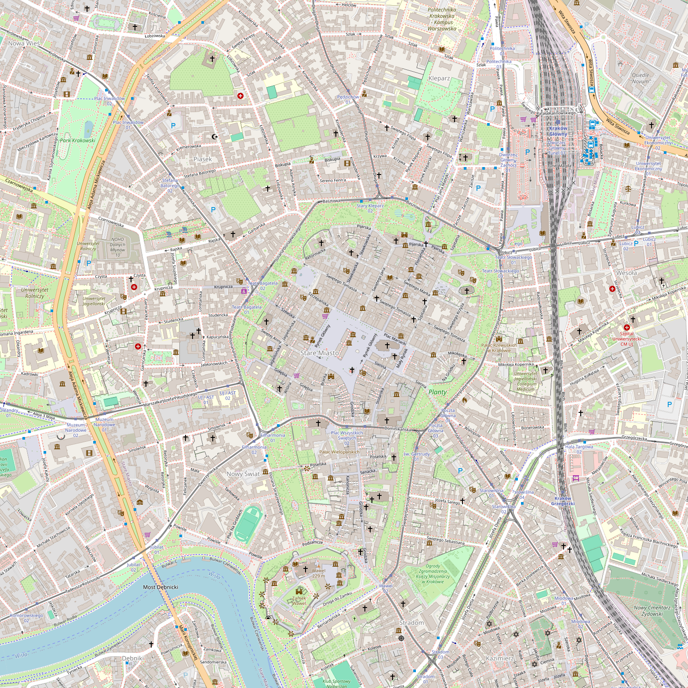

# tile-stitcher

Quick little script to stitch together OSM tiles. Forms an `NxN` square, with a set center point.  
Not tested with anything other than OSM tiles and tilesize of 256px. There's no guarantee it'll work on your machine, due to, for example, internet connection speed constraints. Has absolutely no error handling, so be prepared for any issues that may arise.

Be aware of [tile usage policy](https://operations.osmfoundation.org/policies/tiles/) when stitching tiles. You may easily encounter rate limits, so beware of that. A better option may be to create your own tile server, just for the purpose of stitching.

## Running

Yarn was used as the package manager. It might and will probably work with NPM instead, but I'm yet to try it.  
To run it, download all dependencies by running `yarn` in project's root, followed by `yarn tsc` to compile. You're now ready to run it, using `yarn start`. 

## Example

Here's a small example of it in action, Kraków's city center, formed by stitching together 49-64 tiles at zoom level 16:

